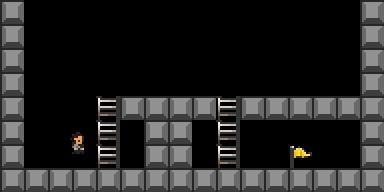

# PyVGDL

A fork/reimplementation of the original
[py-vgdl](https://github.com/schaul/py-vgdl/)
by Tom Schaul.

Under heavy and active development,
just check the latest timestamps in the git history.


## What is it?

VGDL stands for
Video Game Description Language.
PyVGDL is an easily scriptable video game engine written in Python,
ideal for artificial intelligence research.

Given a [game description](examples/continuousphysics/platformer.txt),
it allows you to turn something like
```
w              w
w              w
w              w
w              w
w   HwwwwHwwwwww
w   H ww H     w
wA  H ww H  G  w
wwwwwwwwwwwwwwww
```
… into a human or AI-playable game:



PyVGDL aims to be an engine first,
interfacing with
different frameworks
such as OpenAI Gym ([gym_vgdl](https://github.com/EndingCredits/gym_vgdl))
and [pybrain](vgdl/interfaces/pybrain.py).


## How do I use it?

PyVGDL is excellent for designing your own problem environments
that still share some standard characteristics.
It supports grid phyics and
continuous phyics.

You probably want to use
one of several standard interfaces:
- OpenAI Gym interface
- pybrain interface

Additionally,
I keep a simple library
for human [play](https://github.com/rubenvereecken/play)
that allows one to try out several VGDL games.
This will be folded into the main repository at some point.


## How does it relate to other frameworks

- A more full-fledged VGDL implementation is written and maintained
for the [General Video Game AI Competition](http://www.gvgai.net/),
so look there for more features and expressability.
It features a server-client model written in Java,
tailored for the competition,
whereas this repository
aims to be a complete yet lightweight
Python implementation
for AI research.
